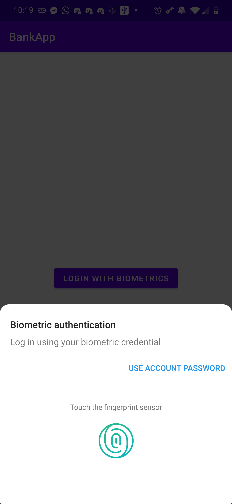
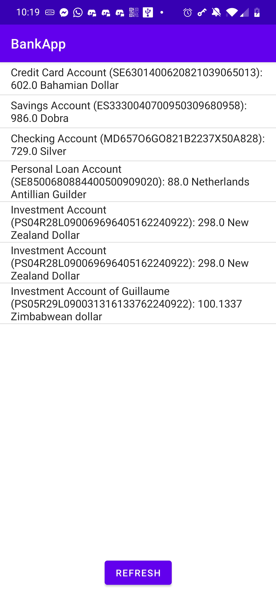

# How do you ensure the user is the right one starting the app?

In order to ensure that the user is the right one, I use biometric login. Upon validation of the user, a new Activity is started.

# How do you securely save user's data on your phone?

In order to securely save the user's data on my phone, I made an Account class which is serializable. The list of accounts is saved by serializing the list in the internal storage, which is only accessible by the application (or, if the phone is rooted, by root).

# How did you hide the API url?

To hide the API url, I used the base64 encoding. While this is easily reversible, it adds a thin layer of security and is not **directly** accessible when decompiling (e.g. jadx). In real world cases, the API should need authentication provided by the user.

# Screenshots

# Video

In the video we can see that the application works offline.

# APK

[BankApp](./WOLFERS_Louis_BankApp.apk)
